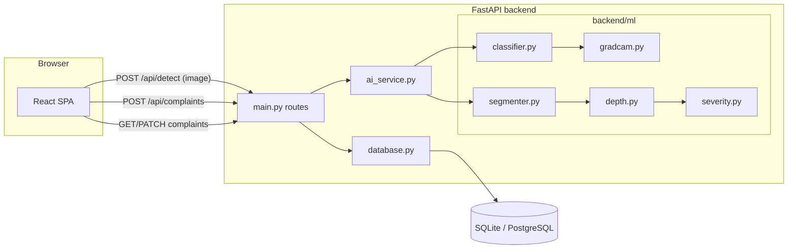

# 01 – System Architecture

## What the project does
Citizens photograph a pothole, the **AI pipeline** analyses it (is it a road? where is the pothole? how severe?), a **complaint** is created with GPS + contact, and municipal officers manage it through a **CMS dashboard** until it is resolved.

## Tech stack
| Layer | Technology | Why |
|---|---|---|
| Frontend | React + TypeScript + Vite, Tailwind | Fast SPA, typed API contracts |
| Backend | FastAPI (Python) | Async, auto-docs at `/docs`, Pydantic validation |
| ML | PyTorch, Ultralytics YOLOv8, torchvision, MiDaS, OpenCV | Industry-standard CV stack |
| Database | SQLite (local) / PostgreSQL (Render) | Zero-setup dev, persistent prod |
| Deploy | Render (`render.yaml`) | Single web service serving API + built frontend |

## Component diagram


## End-to-end flow (what to say in the demo)
1. Citizen opens **Report** page, uploads/captures a photo → `detectPotholes()` in `frontend/src/services/api.ts`.
2. `POST /api/detect` → `ai_service.detect()` runs the 5-stage ML pipeline (see doc 02).
3. UI shows the annotated image, severity, confidence (and Grad-CAM heat-map).
4. Citizen confirms → `POST /api/complaints` stores image + AI result + location in the DB (`status = NEW`).
5. Officer logs in to the **CMS**, filters by severity/status, assigns department/officer, changes status.
6. Officer uploads proof photos and resolves → citizen sees the timeline in the **Track** page.

## Complaint lifecycle
`NEW → UNDER REVIEW → VERIFIED → ASSIGNED → IN PROGRESS → RESOLVED` (or `REJECTED`). Each change appends a `TimelineEvent` (timestamp, status, actor).

## Repository map
```
backend/            FastAPI app, DB layer, ML inference
  main.py           routes
  ai_service.py     orchestrates ML stages
  ml/               one file per ML stage
  models.py         Pydantic schemas (API contract)
  database.py       SQL access + seed data
  weights/          trained model files (created by training)
ml_training/        scripts to build dataset, train, benchmark, calibrate
frontend/src/       React app (components/, services/api.ts)
docs/               these documents
```
