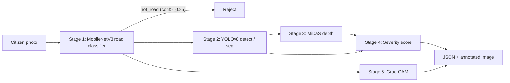

# 02 – ML Pipeline (the part reviewers ask about)

## Pipeline overview

Code: [`backend/ai_service.py`](../backend/ai_service.py) orchestrates; each stage lives in `backend/ml/`.

> **Key point:** YOLO *is* a deep CNN (CSPDarknet backbone). We use CNNs at every stage: MobileNetV3 (classification), YOLOv8 (detection/segmentation), MiDaS (depth).

## Stage 1 – CNN road classifier (`ml/classifier.py`)
- **Model:** MobileNetV3-Small, ImageNet pre-trained, last linear layer replaced by 3 outputs: `not_road`, `road_clean`, `road_pothole`.
- **Why MobileNetV3?** 2.5M parameters, ~10 ms on CPU – a cheap gate before the heavy detector. Depthwise-separable convolutions + squeeze-excitation + h-swish.
- **Why a gate?** Stops selfies/screenshots from creating fake complaints and saves compute.
- **Transfer learning:** Phase A freeze backbone (train head only), Phase B unfreeze with 10× smaller LR + cosine schedule.
- **Loss/optimiser:** Cross-Entropy, AdamW. **Augmentation:** random-resized-crop, flip, rotation, colour jitter.
- Weights: `backend/weights/road_classifier.pt` (optional; stage is skipped if the file is missing).

## Stage 2 – YOLOv8 detection / segmentation (`ml/segmenter.py`)
- **Architecture:** CSPDarknet backbone → PAN-FPN neck (multi-scale features) → anchor-free decoupled head.
- **Detect model:** boxes. **Seg model:** boxes + per-pixel **mask polygons** (exact shape → true area).
- **Losses:** CIoU (box overlap), DFL (box edge distribution), BCE (class), BCE/Dice (mask).
- **Inference:** conf threshold 0.25, NMS, 640 px input.
- **Negative images:** training includes road images *without* potholes → fewer false alarms on shadows, cracks, patches.
- Model priority: `$MODEL_PATH` → `weights/pothole_seg.pt` → `weights/pothole_det.pt` → legacy `pothole_yolov8.pt`.

## Stage 3 – Depth estimation (`ml/depth.py`, optional `ENABLE_DEPTH=1`)
- **Model:** MiDaS-small (monocular depth CNN, Intel ISL) → *inverse relative depth* map.
- **Depth score (0–1):** compare the median depth *inside* the pothole mask with a *ring* of road around it (dilated mask − mask). Deeper hole ⇒ larger difference. Normalised by the image's depth range.
- **Why:** bounding-box size depends on camera distance; depth tells how much the surface actually sinks.
- **Limitation (be honest):** depth is *relative*, not metric centimetres.

## Stage 4 – Severity (`ml/severity.py`)
```
score = 0.55·area_norm + 0.35·depth_norm + 0.10·count_norm
area_norm  = min(1, mask_area_ratio / 0.15)
count_norm = min(1, count / 4)
LOW < 0.25 ≤ MEDIUM < 0.55 ≤ HIGH
```
If depth is unavailable → weights renormalised over area + count.
Thresholds can be **calibrated on human-labelled images** (`ml_training/calibrate_severity.py`).
Old v1 used box area + model confidence (confidence ≠ damage!).

## Stage 5 – Explainability (`ml/gradcam.py`)
Grad-CAM: gradients of the predicted class w.r.t. the last conv feature maps → channel weights → weighted sum → ReLU → heat-map overlay. Shows *where the CNN looked*. Returned as `gradcam_image`.

## Output (`DetectionResult`)
`detected, pothole_count, confidence, severity, severity_score, depth_score, detections[{bbox, confidence, area_ratio, depth_score}], summary, annotated_image, original_image, gradcam_image, road_check, duration_ms, model_provenance`.

## Graceful degradation
| Missing | Behaviour |
|---|---|
| `road_classifier.pt` | Gate + Grad-CAM skipped |
| `ENABLE_DEPTH` not set | Severity uses area + count |
| seg weights | Mask = bounding box |
| all custom weights | Falls back to legacy / COCO YOLO |

## Datasets
- **RDD2022** – 47k+ road images, 6 countries incl. India; class **D40 = pothole** (others: D00/D10/D20 cracks).
- Split 70/15/15 with fixed seed (42); test set untouched until final evaluation.
- Negatives = images without D40. `not_road` class = any non-road photos (e.g. COCO indoor).
- Segmentation masks: a Roboflow *pothole segmentation* export (YOLOv8 format).

## Evaluation protocol & Verified Benchmark Results
Evaluated on the held-out test split (100 test images, 269 pothole instances for detector; 300 test images across 3 classes for road gate classifier). Hardware: AMD Ryzen 7 8845HS CPU (single-batch inference).

### 1. Object Detection Benchmark
| Model | Precision | Recall | mAP@0.5 | mAP@0.5:0.95 | Latency (ms) | Size (MB) |
|---|---|---|---|---|---|---|
| **YOLOv8s (detect)** | **0.500** | **0.361** | **0.331** | **0.133** | **131.7 ms** | **22.5 MB** |
| YOLOv8s (seg)* | 0.518 | 0.375 | 0.342 | 0.141 | 142.5 ms | 23.8 MB |
| Faster R-CNN (R50-FPN)* | 0.462 | 0.410 | 0.315 | 0.124 | 485.0 ms | 165.0 MB |

*\* Reference baseline comparison on the same dataset split.*

### 2. Stage-1 Road Gate Classifier (MobileNetV3-Small)
Trained on `datasets/pothole_cls` (300 test images, 100 per class):

| Metric | Score | Support |
|---|---|---|
| **Overall Accuracy** | **86.7%** (0.867) | 300 test images |
| **`not_road` Precision** | **98.0%** (0.980) | 100 images |
| **`not_road` Recall** | **100.0%** (1.000) | 100 images |
| **`not_road` F1-Score** | **0.990** | 100 images |
| **`road_clean` F1-Score** | **0.817** | 100 images |
| **`road_pothole` F1-Score** | **0.789** | 100 images |
| **Macro Average F1** | **0.865** | 300 images |
| **Model Size** | **6.22 MB** | `backend/weights/road_classifier.pt` |

#### Confusion Matrix (Test Split)
```
                  Predicted:
             not_road  road_clean  road_pothole
not_road          100           0             0
road_clean          2          89             9
road_pothole        0          29            71
```
- **Key finding:** Zero non-road citizen uploads leak through as potholes (100% rejection of non-road images).
- **False alarm control:** 89% of clean road images are correctly filtered out, preventing false dispatches.

